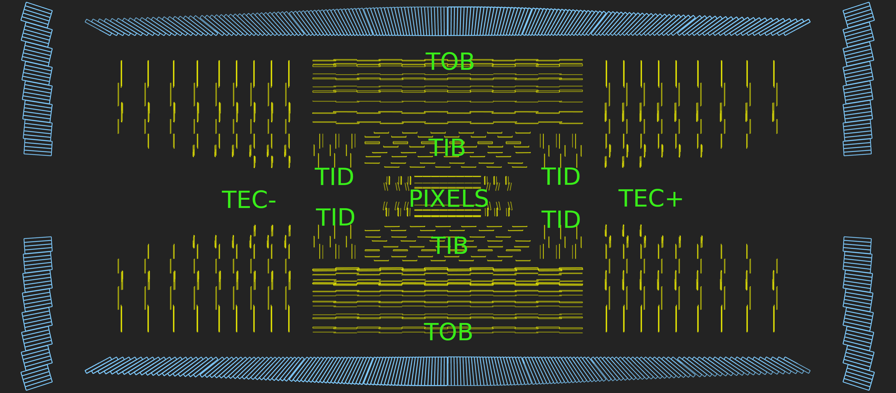
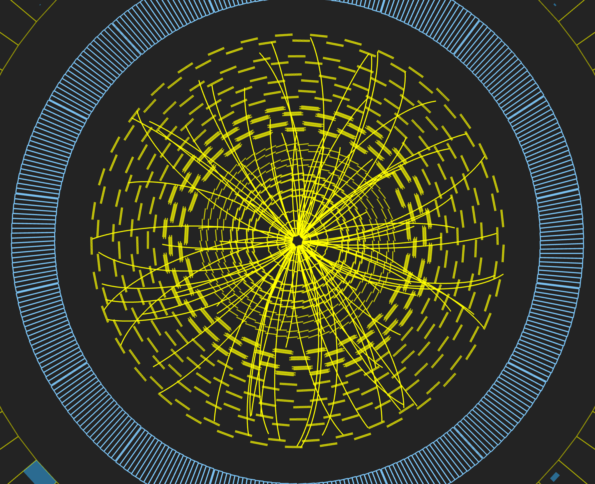

:::::::::: questions
- What is the tracker and how does it work?
::::::::::

:::::::::: objectives
- Learn about the tracker, what it measures, and how it works.
::::::::::

## Tracker

### Overview

Measuring the momentum of particles is crucial in helping us to build up a picture of events at the heart of the collision. One method to calculate the momentum of a particle is to track its path through a magnetic field; the more curved the path, the less momentum the particle had. The CMS tracker records the paths taken by charged particles by finding their positions at a number of key points.

The tracker can reconstruct the paths of high-energy muons, electrons and hadrons as well as see tracks coming from the decay of very short-lived particles such as beauty or “b quarks” that will be used to study the differences between matter and antimatter.

The tracker needs to record particle paths accurately yet be lightweight so as to disturb the particle as little as possible. It does this by taking position measurements so accurate that tracks can be reliably reconstructed using just a few measurement points. Each measurement is accurate to 10 µm, a fraction of the width of a human hair. It is also the inner most layer of the detector and so receives the highest volume of particles: the construction materials were therefore carefully chosen to resist radiation.

The final design consists of a tracker made entirely of silicon: the pixels, at the very core of the detector and dealing with the highest intensity of particles, and the silicon microstrip detectors that surround it. As particles travel through the tracker the pixels and microstrips produce tiny electric signals that are amplified and detected. The tracker employs sensors covering an area the size of a tennis court, with 75 million separate electronic read-out channels: in the pixel detector there are some 6000 connections per square centimetre.

### Pixels

The pixel detector, though only about the size of a small suitcase, contains 124 million pixels, allowing it to track the paths of particles emerging from the collision with extreme accuracy. It is also the closest detector to the beam pipe, with cylindrical layers roughly at 3cm, 7cm, 11cm and 16cm and disks at either end, and so will be vital in reconstructing the tracks of very short-lived particles.

Each of the four layers is composed of individual silicon modules, splitted into little silicon sensors, like tiny kitchen tiles: the pixels.  Each of these silicon pixels is 100µm by 150µm, about two hairs widths. When a charged particle passes through a pixel, it gives enough energy to eject the electrons from silicon atoms. A voltage applied to the sensor allows collecting these charges as a small electric signal, which is amplified by an electronic readout chip (for a total of 16 chips per module).

*Above: A schematic of a pixel detector.*

Knowing which pixels have been touched allows us to deduce the particle's trajectory. And because the detector is made of 2D tiles and has four layers, we can create a three-dimensional picture.

However, being so close to the collision means that the number of particles passing through is huge: the rate of particles received at 3cm from the beamline is around 600 million particles per square centimetre per second! The pixel detector is able to disentangle and reconstruct all the tracks particles leave behind, and withstand such a pummeling over the duration of the experiment. 

### Strips

After the pixels and on their way out of the tracker, particles pass through ten layers of silicon strip detectors, reaching out to a radius of 130 centimetres.

{width="75%"}

*Above: Silicon strips in the tracker barrel.*

The silicon strip detector (see the figure below) consists of four inner barrel (TIB) layers assembled in shells with two inner endcaps (TID), each composed of three small discs. The outer barrel (TOB) – surrounding both the TIB and the TID – consists of six concentric layers. Finally two endcaps (TEC) close off the tracker on either end. Each has silicon modules optimised differently for its place within the detector.

*Above: A projected event display view of the CMS tracker (contained within the ECAL barrel and endcaps) looking perpendicular to the beam pipe.*

This part of the tracker contains 15,200 highly sensitive modules with a total of about 10 million detector strips read by 72,000 microelectronic chips. Each module consists of three elements: one or two silicon sensors, its mechanical support structure and readout electronics.

The silicon detectors work in much the same way as the pixels: as a charged particle crosses the material it knocks electrons from atoms giving a very small pulse of current lasting a few nanoseconds. This small amount of charge is then amplified by Analogue Pipeline Voltage (APV25) chips, giving us “hits” when a particle passes, allowing us to reconstruct its path. Four or six such chips are housed within a “hybrid”, which also contains electronics to monitor key sensor information, such as temperature, and provide timing information in order to match “hits” with collisions.

{width="48%"} | {width="48%"}

*Above left: An event display view of the CMS tracker (contained within the ECAL barrel) looking along the beam pipe. Above right: An event display view of reconstructed tracks.*

{width="48%"} | {width="48%"}

*Above left: A projected event display view of the CMS tracker (contained within the ECAL barrel and endcaps) looking perpendicular to the beam pipe. Above right: A projected event display view of reconstructed tracks.*

:::::::::: keypoints
- A particle emerging from the collision and travelling outwards will first encounter the tracking system, made of silicon pixels and silicon strip detectors.
- The tracker accurately measures the positions of passing charged particles allowing physicists to reconstruct their tracks.
::::::::::
