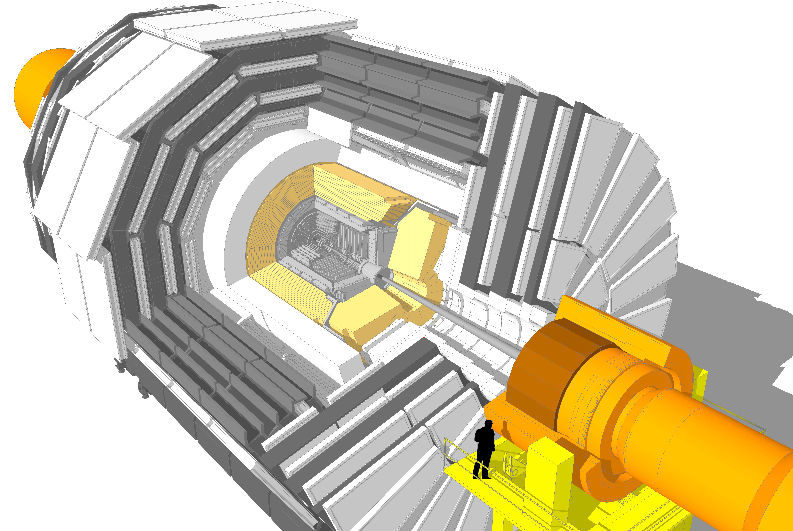

:::::::::: questions
- What is the HCAL?
::::::::::

:::::::::: objectives
- Learn about the HCAL and how it works.
::::::::::

## HCAL

The Hadron Calorimeter (HCAL) measures the energy of “hadrons”, particles made of quarks and gluons (for example protons, neutrons, pions and kaons). Additionally it provides indirect measurement of the presence of non-interacting, uncharged particles such as neutrinos.

Measuring these particles is important as they can tell us if new particles such as the Higgs boson or supersymmetric particles (much heavier versions of the standard particles we know) have been formed.
As these particles decay they may produce new particles that do not leave record of their presence in any part of the CMS detector. To spot these the HCAL must be “hermetic”, that is make sure it captures, to the extent possible, every particle emerging from the collisions. This way if we see particles shoot out one side of the detector, but not the other, with an imbalance in the momentum and energy (measured in the sideways “transverse” direction relative to the beam line), we can deduce that we’re producing “invisible” particles.

To ensure that we’re seeing something new, rather than just letting familiar particles escape undetected, layers of the HCAL were built in a staggered fashion so that there are no gaps in direct lines that a familiar particle might escape through.

The HCAL is a sampling calorimeter [see explanation below] meaning it finds a particle’s position, energy and arrival time using alternating layers of “absorber” and fluorescent “scintillator” materials that produce a rapid light pulse when the particle passes through. Special optic fibres collect up this light and feed it into readout boxes where photodetectors amplify the signal.   When the amount of light in a given region is summed up over many layers of tiles in depth, called a “tower”, this total amount of light is a measure of a particle’s energy.
As the HCAL is massive and thick, fitting it into “compact” CMS was a challenge, as the cascades of particles produced when a hadron hits the dense absorber material (known as showers) are large, and the minimum amount of material needed to contain and measure them is about one metre.   

To accomplish this feat, the HCAL is organised into barrel (HB and HO), endcap (HE) and forward (HF) sections. There are 36 barrel “wedges”, each weighing 26 tonnes. These form the last layer of detector inside the magnet coil whilst a few additional layers, the outer barrel (HO), sit outside the coil, ensuring no energy leaks out the back of the HB undetected.  Similarly, 36 endcap wedges measure particle energies as they emerge through the ends of the solenoid magnet.

Lastly, the two hadronic forward calorimeters (HF) are positioned at either end of CMS, to pick up the myriad particles coming out of the collision region at shallow angles relative to the beam line. These receive the bulk of the particle energy contained in the collision so must be very resistant to radiation and use different materials to the other parts of the HCAL.

*Above: A schematic view of the HCAL detectors, looking "from the side", perpendicular to the beam pipe.*

The CMS barrel and endcap sampling calorimeters are made of repeating layers of dense absorber and tiles of plastic scintillator. When a hadronic particle hits a plate of absorber, in this case brass or steel, an interaction can occur producing numerous secondary particles. As these secondary particles flow through successive layers of absorber they too can interact and a cascade or “shower” of particles results.  As this shower develops, the particles pass through the alternating layers of active scintillation material causing them to emit blue-violet light. Within each tile tiny optical “wavelength-shifting fibres”, with a diameter of less than 1mm, absorb this light. These shift the blue-violet light into the green region of the spectrum, and clear optic cables then carry the green light away to readout boxes located at strategic locations within the HCAL volume.

A megatile is a layer of tiles whose sizes depend on their spatial location and orientation relative to the collision, chosen so that each receives roughly the same number of particles. Optic fibres fit into grooves cut into the individual tiles. Because the light picked up gives a measure of energy, the gaps between tiles must be filled with a reflective paint to ensure that light produced in each tile cannot escape into others and vice versa.

:::::::::: keypoints:
- The HCAL measures the energy of “hadrons”, particles made of quarks and gluons (for example protons, neutrons, pions and kaons).
- The HCAL is hermetic, made up of a barrel, endcaps, and forrward and outer detectors.
::::::::::
