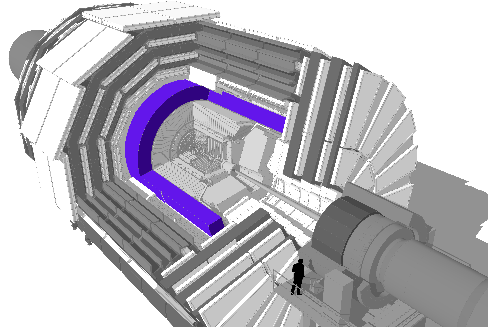

::::::::::: questions

- What is the magnet in CMS and what does it do?

:::::::::::

::::::::::: objectives

- Learn about the magnet and how it works.

:::::::::::

## Magnet

The CMS magnet is the central device around which the experiment is built, with a 4 Tesla magnetic field that is 100,000 times stronger than the Earth’s.

Its job is to bend the paths of particles emerging from high-energy collisions in the LHC. The more momentum a particle has the less its path is curved by the magnetic field, so tracing its path gives a measure of momentum. CMS began with the aim of having the strongest magnet possible because a higher strength field bends paths more and, combined with high-precision position measurements in the tracker and muon detectors, this allows accurate measurement of the momentum of even high-energy particles.

The CMS magnet is a “solenoid” - a magnet made of coils of wire that produce a uniform magnetic field when electricity flows through them. The CMS magnet is “superconducting”, allowing electricity to flow without resistance and creating a powerful magnetic field. In fact at ordinary temperatures the strongest possible magnet has only half the strength of the CMS solenoid.

The tracker and calorimeter detectors (ECAL and HCAL) fit snugly inside the magnet coil whilst the muon detectors are interleaved with a 12-sided iron structure that surrounds the magnet coils and contains and guides the field. Made up of three layers this “return yoke” reaches out 14 metres in diameter and also acts as a filter, allowing through only muons and weakly interacting particles such as neutrinos. The enormous magnet also provides most of the experiment’s structural support, and must be very strong itself to withstand the forces of its own magnetic field.

::::::::::: keypoints

- The CMS magnet is the central device around which the experiment is built, with a 3.7 Tesla magnetic field.
- The magnet's job is to bend the paths of particles emerging from high-energy collisions.
- The strong magnetic field, combined with high-precision position measurements in the tracker and muon detectors, this allows accurate measurement of the momentum of even high-energy particles.
- The CMS magnet is a superconducting solenoid.
- The tracker and calorimeter detectors (ECAL and HCAL) fit snugly inside the magnet.

:::::::::::
