:::::::::::: questions

- What are the muon detectors in CMS and how do they work?

::::::::::::

:::::::::::: objectives

- Learn about the muon detectors and how it works.

::::::::::::

## Muon detectors

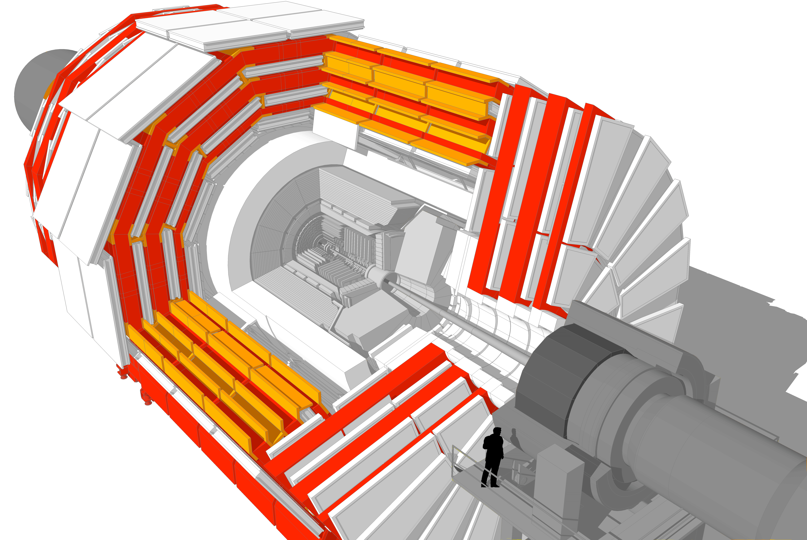

### Overview

As the name “Compact Muon Solenoid” suggests, detecting muons is one of CMS’s most important tasks.
Muons are charged particles that are just like electrons and positrons, but are 200 times heavier.

Because muons can penetrate several metres of iron without interacting, unlike most particles they are not stopped by any of CMS's calorimeters. Therefore, chambers to detect muons are placed at the very edge of the experiment where they are the only particles likely to register a signal.

A particle is measured by fitting a curve to hits among the four muon stations, which sit outside the magnet coil and are interleaved with iron "return yoke" plates (shown in red below, for the barrel region). By tracking its position through the multiple layers of each station, combined with tracker measurements the detectors precisely trace a particle’s path. This gives a measurement of its momentum because we know that particles travelling with more momentum bend less in a magnetic field. As a consequence, the CMS magnet is very powerful so we can bend even the paths of very high-energy muons and calculate their momenta.

In total there are 1400 muon chambers: 250 drift tubes (DTs) and 540 cathode strip chambers (CSCs) track the particles’ positions and provide a trigger, while 610 resistive plate chambers (RPCs) form a redundant trigger system, which quickly decides to keep the acquired muon data or not. Because of the many layers of detector and different specialities of each type, the system is naturally robust and able to filter out background noise.

DTs and RPCs are arranged in concentric cylinders around the beam line (“the barrel region”) whilst CSCs and RPCs, make up the “endcaps” disks that cover the ends of the barrel.

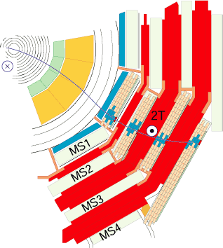

*Above: A transverse slice of CMS slowing a muon passing through RPCs and DTs in the barrel.*

### Drift tubes

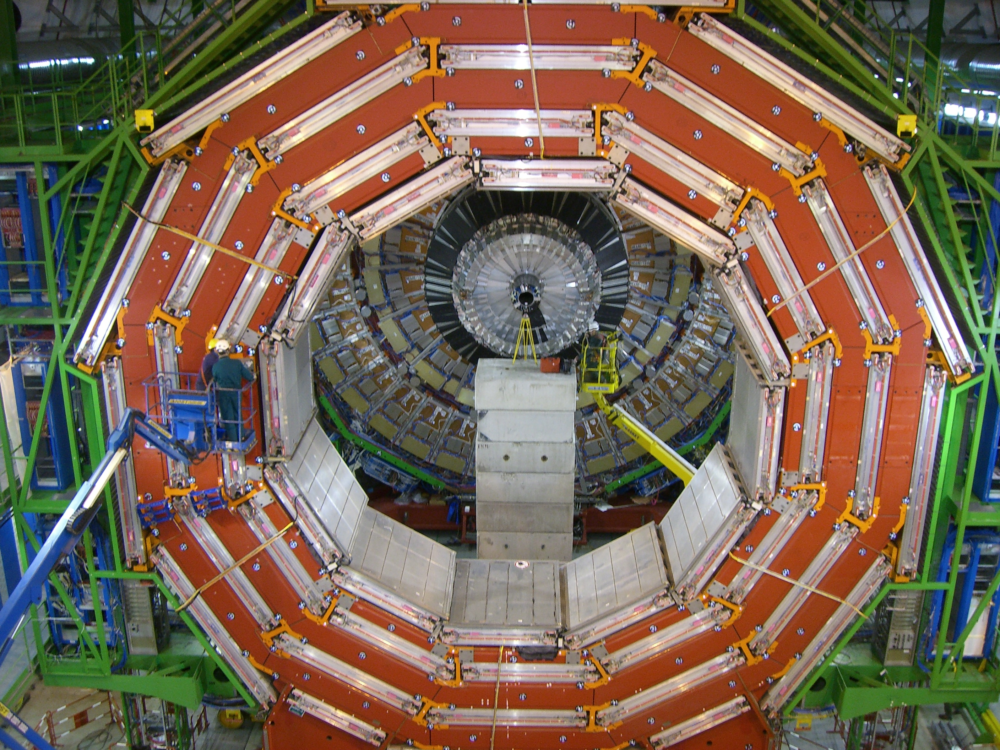{width="48%"} | 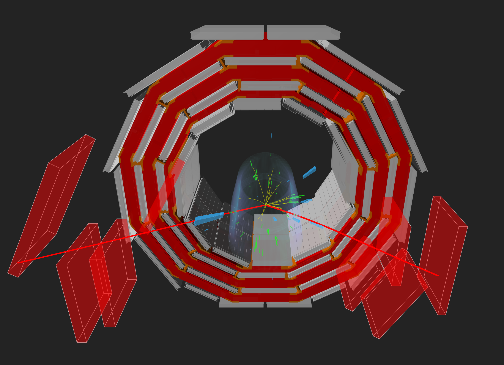{width="48%"}

*Above left: Installation of a wheel of drift tubes. Above right: event display of two muons seen in CMS with matching drift tubes.*

The drift tube (DT) system measures muon positions in the barrel part of the detector. Each 4-cm-wide tube contains a stretched wire within a gas volume. When a muon or any charged particle passes through the volume it knocks electrons off the atoms of the gas. These follow the electric field ending up at the positively-charged wire.

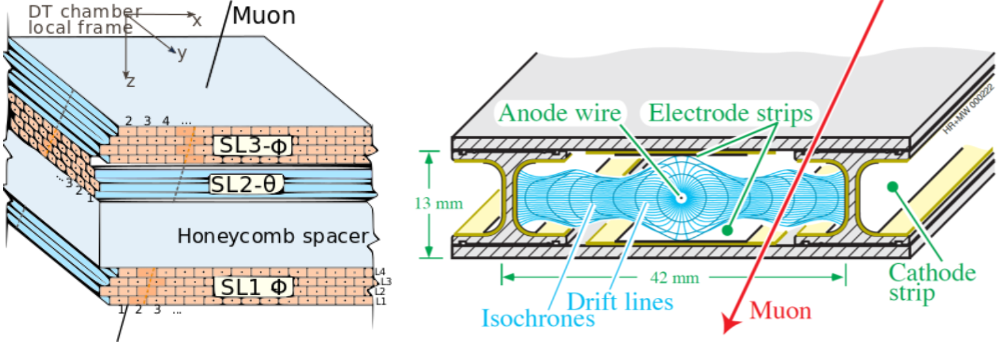{width="75%"}

By registering where along the wire electrons hit (in the diagram, the wires are going into the page) as well as by calculating the muon's original distance away from the wire (shown here as horizontal distance and calculated by multiplying the speed of an electron in the tube by the time taken) DTs give two coordinates for the muon’s position.

Each DT chamber, on average 2m x 2.5m in size, consists of 12 aluminium layers, arranged in three groups of four, each up with up to 60 tubes: the middle group measures the coordinate along the direction parallel to the beam and the two outside groups measure the perpendicular coordinate.

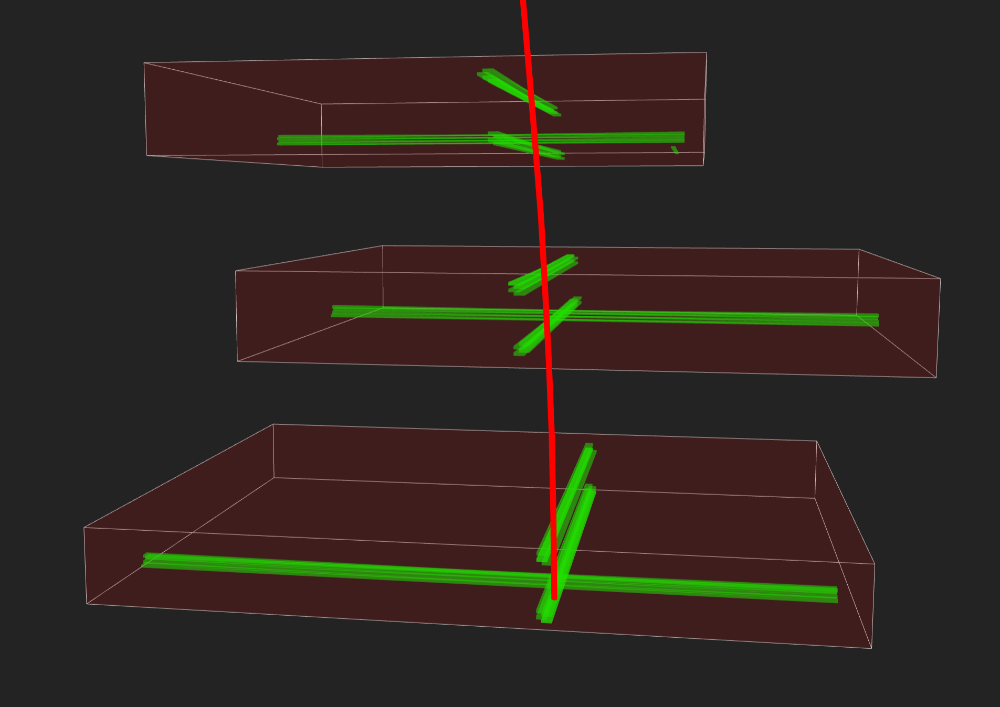{width="75%"}

*Above: An event display of a muon seen in DTs. The green volumes indicate the position of the triggered wires.*

### Cathode Strip Chambers

Cathode strip chambers (CSC) are used in the endcap disks where the magnetic field is uneven and particle rates are high.

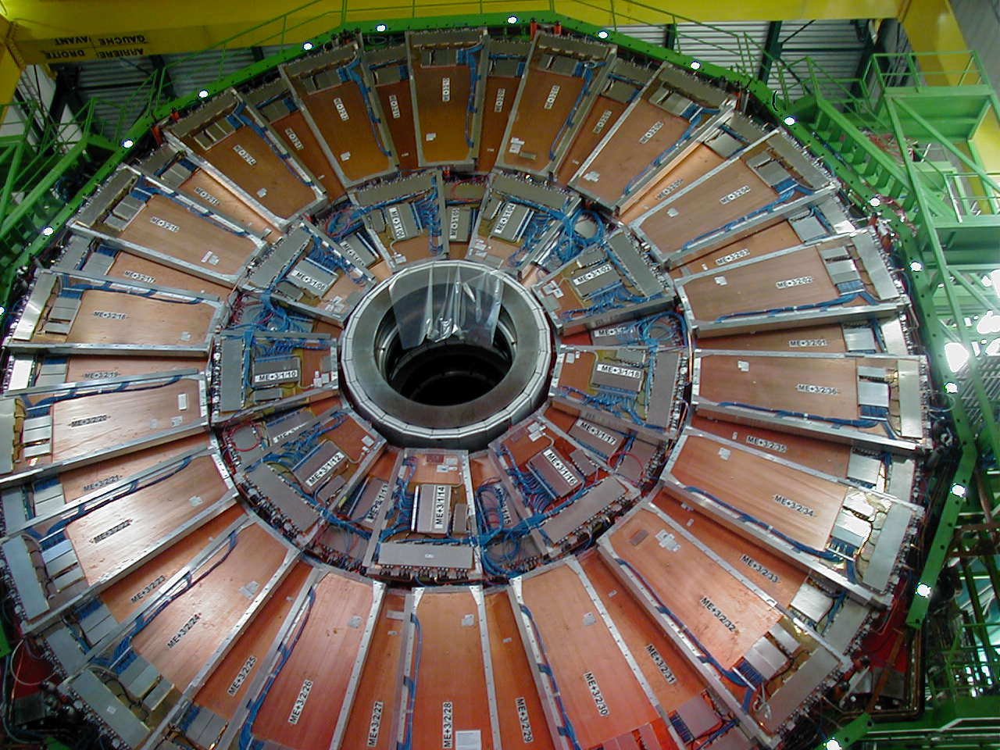{width="75%"}

*Above: Installed CSCs.*

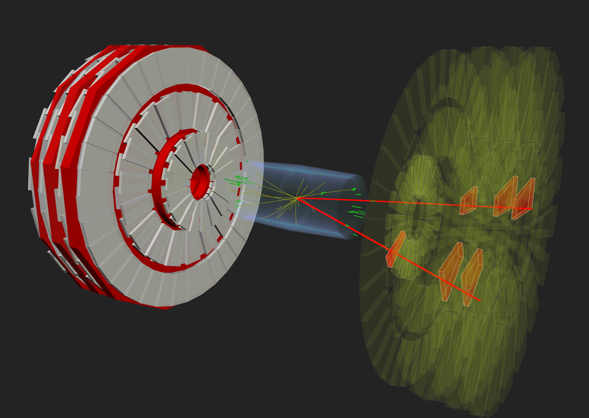{width="75%"}

*Above: A double muon event seen in CMS with highlighted matching CSCs (in red).*

CSCs consist of arrays of positively-charged “anode” wires crossed with negatively-charged copper “cathode” strips within a gas volume. When muons pass through, they knock electrons off the gas atoms, which flock to the anode wires creating an avalanche of electrons. Positive ions move away from the wire and towards the copper cathode, also inducing a charge pulse in the strips, at right angles to the wire direction.

Because the strips and the wires are perpendicular, we get two position coordinates for each passing particle.
In addition to providing precise space and time information, the closely spaced wires make the CSCs fast detectors suitable for triggering. Each CSC module contains six layers making it able to accurately identify muons and match their tracks to those in the tracker.

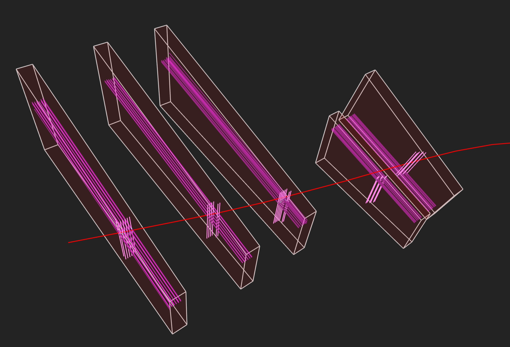{width="75%"}

*Above: Event display of a muon seen in CSCs. The pink lines running along the long end of the chambers indicate the triggered strips and the shorter pink lines represent the triggered wires.*

### Resistive Plate Chambers

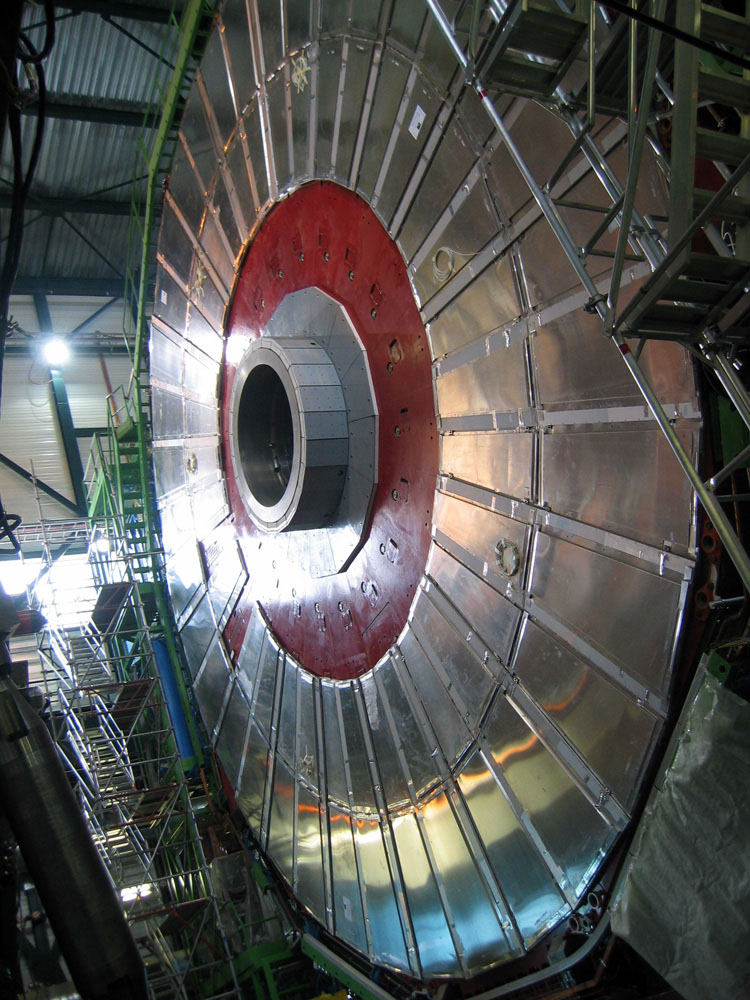

*Above: Resistive plate chambers installed on one of the CMS muon endcaps.*

Resistive plate chambers (RPC) are fast gaseous detectors that provide a muon trigger system parallel with those of the DTs and CSCs.

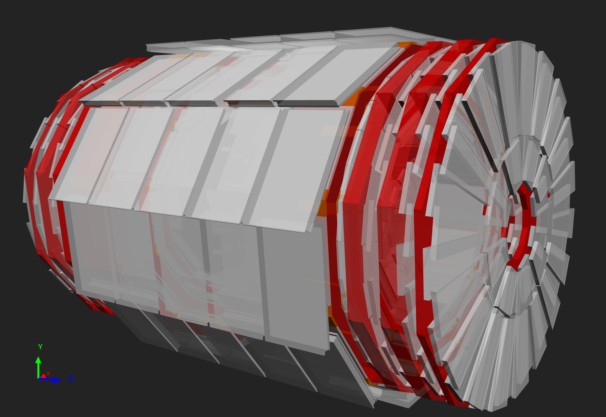{width="32%"} | 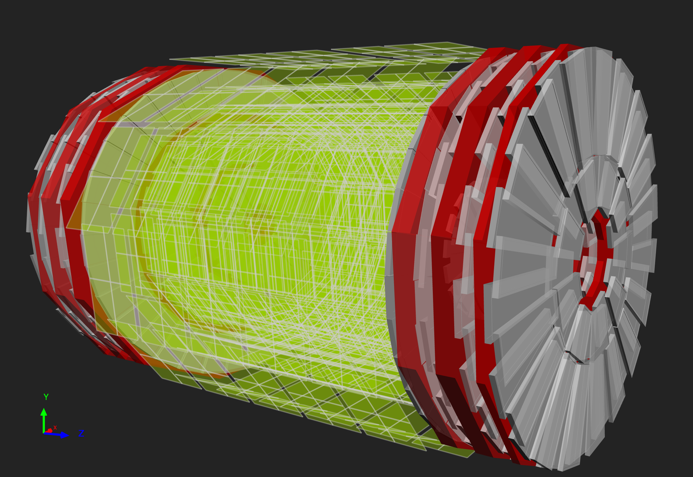{width="32%"} | 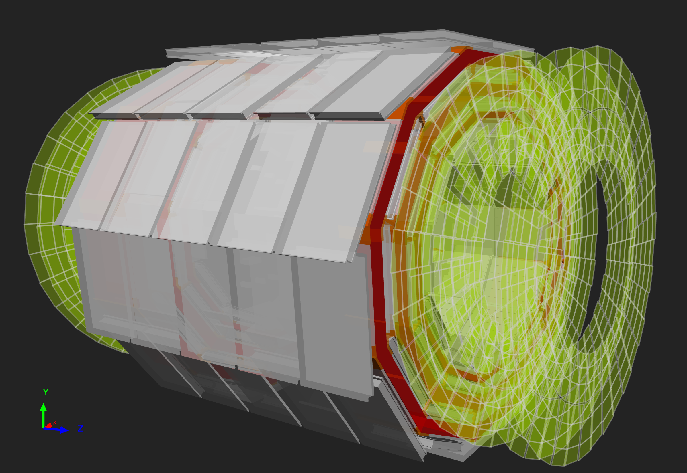{width="32%"}

*Above: The positions of the RPCs in the barrel and endcaps highlighted in green*

RPCs consist of two parallel plates, a positively-charged anode and a negatively-charged cathode, both made of a very high resistivity plastic material and separated by a gas volume.

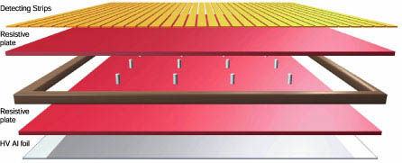

*Above: The layers of an RPC*

When a muon passes through the chamber, electrons are knocked out of gas atoms. These electrons in turn hit other atoms causing an avalanche of electrons. The electrodes are transparent to the signal (the electrons), which are instead picked up by external metallic strips after a small but precise time delay. The pattern of hit strips gives a quick measure of the muon momentum, which is then used by the trigger to make immediate decisions about whether the data are worth keeping. RPCs combine a good spatial resolution with a time resolution of just one nanosecond (one billionth of a second).

:::::::::::: keypoints:

- There are three main muon detector systems in CMS: the drift tubes, cathode strip chambers, and resistive plate chambers.

::::::::::::
